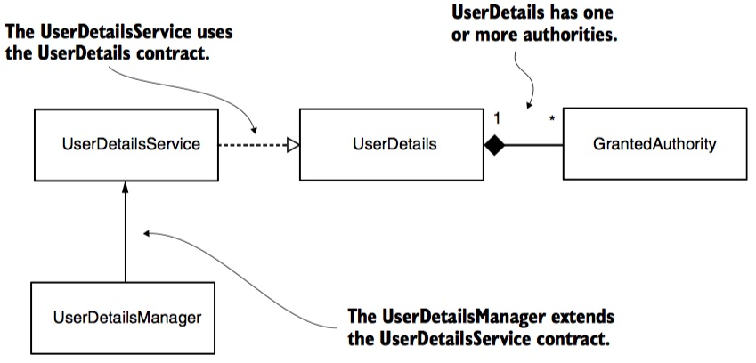
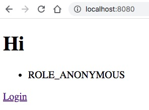
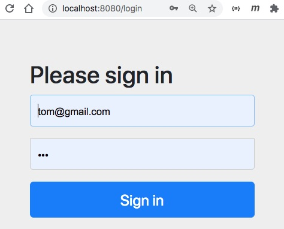
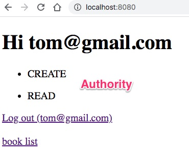
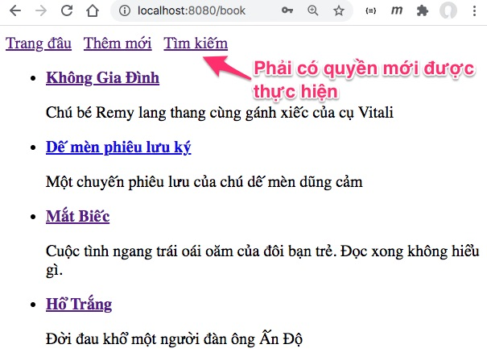
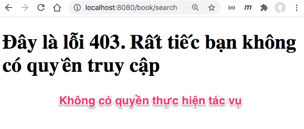

# User Detail Service, Authority

## Lý thuyết
Trong bài này, chúng ta sẽ bàn đến UserDetails và UserDetailsManager:

1. UserDetails: Tạo class mới tuân thủ UserDetails dùng để mô tả tài khoản đăng nhập gắn với mỗi người dùng
2. GrantedAuthority: mô tả những hành động nào tài khoản được phép thực hiện
3. UserDetailsManager mở rộng từ UserDetailsService bổ xung các phương thức: tạo user, sửa đổi, và xoá user. Ví dụ này dùng ```InMemoryUserDetailsManager```
4. Authority khác với Role như thế nào?


Phần chức năng tôi bê nguyên ví dụ [crud/08Search/bookstore/](https://github.com/TechMaster/SpringBootBasic/tree/main/crud/08Search/bookstore) đã học trước đây.

## Thực hành
### 1. Một số hình ảnh ứng dụng
Khi chưa đăng nhập



Form đăng nhập có sẵn trong Spring Boot



Sau khi người dùng login sẽ liệt kê danh sách quyền được làm. Giao diện cùi bắp chỉ để demo cho trực quan.


Màn hình liệt kê sách. Người dùng phải có quyền thích hợp mới được xem, tạo, sửa, xoá, tìm kiếm

### 2. Cấu trúc thư mục dự án
```
.
├── java
│   └── vn
│       ├── techmaster
│       │   └── simpleauthen
│       │       ├── config
│       │       │   └── RepoConfig.java
│       │       ├── controller
│       │       │   ├── BookController.java
│       │       │   └── HomeController.java
│       │       ├── model
│       │       │   ├── Book.java
│       │       │   └── User.java  <-- Đối tượng user login`
│       │       ├── repository
│       │       │   ├── BookDao.java  <-- Book Data Access Object
│       │       │   └── Dao.java <-- Đây là interface
│       │       ├── request
│       │       │   └── SearchRequest.java <-- Search Request POJO
│       │       ├── security
│       │       │   ├── Authority.java  <-- Enum chứa các hành động được phép làm
│       │       │   ├── CustomAuthenProvider.java
│       │       │   ├── Role.java <-- Chứa các role ở bài này không dùng đến
│       │       │   └── SecurityConfig.java  <-- Cấu hình Authentication, Authorization
│       │       └── SimpleauthenApplication.java
├── resources
│   ├── static
│   │   └── book.csv <-- Danh sách Book ban đầu sẽ nạp vào. Học từ hồi chưa dùng JPA
│   ├── templates
│   │   ├── error <-- Các file báo lỗi customize
│   │   │   ├── 401.html
│   │   │   ├── 403.html
│   │   │   ├── 404.html
│   │   │   ├── 500.html
│   │   │   └── error.html
│   │   ├── allbooks.html <-- Liệt kế các sách
│   │   ├── book.html
│   │   ├── form.html
│   │   ├── index.html <-- Trang chủ
│   │   └── search.html <-- Tìm kiếm
│   └── application.properties
```


### 3. Định nghĩa danh sách các hành động được phép làm (Authority) 
Xem [Authority.java](src/main/java/vn/techmaster/simpleauthen/security/Authority.java)

Tôi dùng ```public static final``` để định nghĩa các constant string
```java
public class Authority {
  public static final String READ = "READ";  //Đọc được
  public static final String CREATE = "CREATE"; //Tạo được sách mới
  public static final String DELETE = "DELETE"; //Xoá được sách
  public static final String EDIT = "EDIT"; //Sửa được sách hiện tại
  public static final String SEARCH = "SEARCH"; //Tìm kiếm được sách
  private Authority() {}
}
```

*Có cách nào khác cách làm này? Có ! bạn cứ dùng thẳng String nhưng code sẽ không clean, và dễ có lỗi.*
### 4. Tạo class User tuân thủ interface UserDetails

*Có cần nhất thiết lúc nào cũng phải tạo class User không?
Câu trả lời là không. Bạn vẫn có thể dùng class User mặc định trong Spring Security. Tuy nhiên nếu cần thêm các thuộc tính mới, phương thức mới cho User thì phải tạo ra một class mới.*

```UserDetails``` là một interface kế thừa ```interface Serializable```
```java
public interface UserDetails extends Serializable {
	Collection<? extends GrantedAuthority> getAuthorities();  //Lấy danh sách các quyền được phép làm
	String getPassword();  //lấy password đã băm, mã hoá
	String getUsername(); //lấy username
	boolean isAccountNonExpired();  //Tài khoản chưa bị hết hạn?
	boolean isAccountNonLocked();  //Tài khoản không bị khoá?
	boolean isCredentialsNonExpired(); //Thời hạn truy cập vẫn còn?
	boolean isEnabled(); //Tài khoản được kích hoạt?
}
```

Tôi tạo ra [một class User mới](src/main/java/vn/techmaster/simpleauthen/model/User.java) tuân thủ ```interface UserDetails```. Bạn có thể bổ xung thêm thuộc tính tuỳ thích cho class này, miễn là nó đảm bảo đủ các phương thức trong ```interface UserDetails``` để phục vụ cho việc xác thực và phân quyền.

Chú ý phương thức này. Tham số vào là 1 hoặc nhiều chuỗi định nghĩ quyền được làm gì.

```java
public void setAuthority(String ... stringAuthorities) {
  for (String authority : stringAuthorities) {
      //this.authorities.add(new Authority(authority)); cách này cổ điển dễ hiểu
      this.authorities.add(() -> authority);  //Dùng lambda expression cho hiện đại thôi
  }
}
```

Thực tế khi dùng sẽ như sau:
```java
User jane = new User("jane@gmail.com", encoder().encode("123"));
jane.setAuthority(Authority.READ, Authority.CREATE, Authority.EDIT);
```

### 5. Phân quyền theo hành động
Ở bài trước chúng ta phân quyền theo vai trò (Role). Còn ở bài này, chúng ta lại phân quyền theo hành động được làm gì.
Mô hình chung sẽ là: một user có thể có nhiều Role. Trong một Role có thể có nhiều quyền. Trong ví dụ này tạm tập trung vào Authority thôi đã. Ví dụ sau sẽ có đủ Role + Authority.

Dưới đây là phương thức cấu hình phân quyền theo loại request, đường dẫn và quyền Authority.
```java
@Override
protected void configure(HttpSecurity http) throws Exception {
  http.formLogin();
  http.authorizeRequests()
    .antMatchers(HttpMethod.GET, "/book").hasAuthority(Authority.READ)
    .antMatchers(HttpMethod.GET, "/book/add").hasAuthority(Authority.CREATE)
    .antMatchers(HttpMethod.POST, "/book/save").hasAuthority(Authority.CREATE)
    .antMatchers(HttpMethod.GET, "/book/{\\d+}").hasAuthority(Authority.READ)
    .antMatchers(HttpMethod.GET, "/book/edit/{\\d+}").hasAuthority(Authority.EDIT)
    .antMatchers(HttpMethod.GET, "/book/delete/{\\d+}").hasAuthority(Authority.DELETE)
    .antMatchers(HttpMethod.GET, "/book/search").hasAuthority(Authority.SEARCH)
    .antMatchers(HttpMethod.POST, "/book/search").hasAuthority(Authority.SEARCH)
    .antMatchers("/**").permitAll();
}
```

Chú ý ```.antMatchers``` nhận tham số đầu là loại request: POST/GET/PUT/DELETE..., các tham số tiếp các đường dẫn.

```/book/{\\d+}``` trong đó ```{\\d+}``` là tham số id. Với d+ trong regular expression có nghĩa là một hay nhiều chữ số.

Có 2 khả năng: 
- ```.hasAuthority``` : buộc phải có một Authority cụ thể
- ```.hasAnyAuthority```: có thể có một trong những Authority liệt kê

### 6. Tạo sẵn một số User trong InMemoryUserDetailsManager
Trong file [SecurityConfig.java](src/main/java/vn/techmaster/simpleauthen/security/SecurityConfig.java), ở phương thức tạo bean InMemoryUserDetailsManager, tôi tạo sẵn các user tom, bob, alice, jane với các quyền khác nhau.

```java
@Bean
public InMemoryUserDetailsManager inMemoryUserDetailsManager() {
  Collection<UserDetails> users = new ArrayList<>();


  User tom = new User("tom@gmail.com", encoder().encode("123"));
  tom.setAuthority(Authority.READ, Authority.CREATE);


  User bob = new User("bob@gmail.com", encoder().encode("123"));
  bob.setAuthority(Authority.READ, Authority.SEARCH);

  User alice = new User("alice@gmail.com", encoder().encode("123"));
  alice.setAuthority(Authority.READ, Authority.DELETE);

  User jane = new User("jane@gmail.com", encoder().encode("123"));
  jane.setAuthority(Authority.READ, Authority.CREATE, Authority.EDIT);

  users.add(tom);
  users.add(bob);
  users.add(alice);
  users.add(jane);

  return new InMemoryUserDetailsManager(users);
}
```

### 7. Màn hình trang chủ, hiển thị tên login và các quyền


```java
@GetMapping("/")
public String showHomePage(Principal principal, Model model) {
  String loginName = (principal != null) ? principal.getName() : "";

  var authorities = SecurityContextHolder.getContext().getAuthentication().getAuthorities();

  for (var authority:authorities) {
    System.out.println(authority.getAuthority());
  }
  
  model.addAttribute("login_name", loginName);
  model.addAttribute("authorities", authorities);
  return "index";
}
```
```Principal principal``` được tự động truyền vào như làm tham số. Nếu người dùng đăng nhập thì principal khác null và có thể lấy tên đăng nhập bằng 
```principal.getName()```

Đoạn lệnh này sẽ liệt kê các quyền ứng với tài khoản đăng nhập:
```java
var authorities = SecurityContextHolder.getContext().getAuthentication().getAuthorities();
for (var authority:authorities) {
  System.out.println(authority.getAuthority());
}
```
Khi thực hiện tác vụ mà bạn không có quyền thì sẽ nhận được báo lỗi như sau:



Trang báo lỗi 403 được tôi customize [403.html](target/classes/templates/error/403.html)

## Đọc thêm
- [Granted Authority Versus Role in Spring Security](https://www.baeldung.com/spring-security-granted-authority-vs-role)
- [Spring Boot Security Role-based Authorization Tutorial](https://www.codejava.net/frameworks/spring-boot/spring-boot-security-role-based-authorization-tutorial)

https://www.baeldung.com/role-and-privilege-for-spring-security-registration