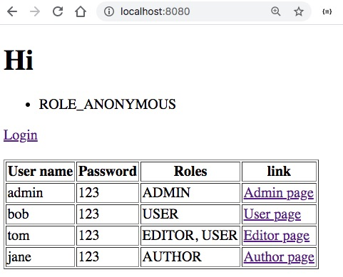
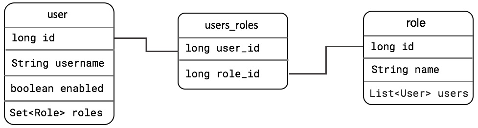

# Sử dụng JPA, H2 để lưu thông tin User và Role


Trong bài này, chúng ta H2, in memory database để lưu user, role. Chúng ta cũng giả định đồng nhất khái niệm Role với Authority. Trong thực tế, các bạn có thể dùng MySQL, Postgresql, Oracle, hay MSSQL để lưu trữ danh sách người dùng, và role.
Ở các bài tiếp theo, chúng ta mới mở rộng 1 role (vai trò) có thể chứa nhiều priviledge (quyền hạn)

Giao diện tôi làm thực sự là thô và xấu. Vì tôi không dành thời gian trang trí. Code ngắn nhất để các bạn dễ theo dõi



## Cấu trúc thư mục

```
.
├── java
│   └── vn
│       └── techmaster
│           └── securityjpa
│               ├── config
│               │   └── SecurityConfig.java <-- Cấu hình phân quyền theo đường dẫn truy cập
│               ├── controller
│               │   └── HomeController.java <-- Controller điều hướng, xử lý request đến
│               ├── model
│               │   ├── Role.java  <-- Định nghĩa Entity Role
│               │   └── User.java  <-- Định nghĩa Entity User
│               ├── repository
│               │   ├── RoleRepository.java <-- Repo thao tác dữ liệu với Entity Role
│               │   └── UserRepository.java <-- Repo thao tác dữ liệu với Entity User
│               ├── service
│               │   ├── ISecurityService.java <-- Interface của SecurityService
│               │   └── SecurityService.java <-- Implementation của SecurityService
│               ├── AppRunner.java <-- Bổ xung logic mặc định sẽ chạy khi ứng dụng Spring Boot khởi động
│               └── SecurityjpaApplication.java
├── resources
│   ├── static
│   ├── templates
│   │   ├── error <-- Thư mục chứa các file báo lỗi customize
│   │   │   ├── 401.html
│   │   │   ├── 403.html
│   │   │   ├── 404.html
│   │   │   ├── 500.html
│   │   │   └── error.html
│   │   ├── admin.html  <-- Trang admin chỉ role ADMIN mới được truy cập
│   │   ├── author.html <-- Trang author chỉ role AUTHOR mới được truy cập
│   │   ├── editor.html <-- Trang editor chỉ role EDITOR mới được truy cập
│   │   ├── free.html   <-- Trang editor chỉ role EDITOR mới được truy cập
│   │   ├── index.html
│   │   └── user.html
│   └── application.properties <-- Cấu hình ứng dụng
```
## Thực hành
### 1. Cấu hình căn bản

File [pom.xml](pom.xml) cần có các dependencies:
1. spring-boot-starter-data-jpa
2. lombok
3. h2
4. spring-boot-starter-web
5. spring-boot-starter-thymeleaf

File [application.properties](application.properties)
```
spring.datasource.url=jdbc:h2:mem:test
spring.datasource.driverClassName=org.h2.Driver
spring.datasource.username=sa
spring.datasource.password=123
spring.jpa.database-platform=org.hibernate.dialect.H2Dialect
spring.h2.console.enabled=true

server.error.whitelabel.enabled=false
```

### 2. Xây dựng entity User



Class [User](src/main/java/vn/techmaster/securityjpa/model/User.java) có 2 nhiệm vụ:
1. Định nghĩa Entity User để lưu thông tin xuống bảng trong CSDL
2. Kế thừa ```interface UserDetails``` để có thể sử dụng trong Spring Security

```java
@Entity(name = "user")
@Table(name = "user")
@Data
@NoArgsConstructor //Phải có không là báo lỗi No default constructor for entity vn.techmaster.securityjpa.model.User
public class User implements UserDetails {
  private static final long serialVersionUID = 6268404888144025944L; //Vì interface UserDetails kết thừa interface Serialize

  @Id
  @Column(name = "user_id")
  @GeneratedValue(strategy = GenerationType.IDENTITY)
  private Long id;

  @NaturalId
  @Column(unique = true, nullable = false) //User name buộc phải unique, khác null, nó cũng là natural id luôn
  private String username;

  @Column(nullable = false)
  private String password;
  private boolean enabled;


  @ManyToMany(cascade = CascadeType.ALL, fetch = FetchType.EAGER)
  @JoinTable(
    name = "users_roles", 
    joinColumns = @JoinColumn(name = "user_id"), 
    inverseJoinColumns = @JoinColumn(name = "role_id")
  )
  private Set<Role> roles = new HashSet<>();

  public void addRole(Role role) {
    roles.add(role);
    role.getUsers().add(this);
  }

  public void removeRole(Role role) {
    roles.remove(role);
    role.getUsers().remove(this);
  }

  //--- Constructor --------------------------------
  public User(String username, String password) {
    this.username = username;
    this.password = password;
    this.enabled = true;
  }


  //-------- Implements các methods của interface UserDetails
  @Override
  public Collection<? extends GrantedAuthority> getAuthorities() {
    List<SimpleGrantedAuthority> authorities = new ArrayList<>();         
    for (Role role : roles) {
        authorities.add(new SimpleGrantedAuthority(role.getName()));
    }      
    return authorities;
  }

  @Override
  public boolean isAccountNonExpired() {
    return true;
  }

  @Override
  public boolean isAccountNonLocked() {
    return true;
  }

  @Override
  public boolean isCredentialsNonExpired() {
    return true;
  }

  @Override
  public boolean isEnabled() {
    return this.enabled;
  }
}
```

Ở đây chúng ta sử dụng ```SimpleGrantedAuthority``` ánh xạ 1:1 Role với Authority. Trong tương lai chúng ta có để định nghĩa 1 Role chứa nhiều Authority. Bằng cách tạo thêm quan hệ nhiều nhiều giữa Role và Authority!
```java
@Override
public Collection<? extends GrantedAuthority> getAuthorities() {
  List<SimpleGrantedAuthority> authorities = new ArrayList<>();         
  for (Role role : roles) {
      authorities.add(new SimpleGrantedAuthority(role.getName()));
  }      
  return authorities;
}
```
### 3. Xây dựng entity Role

Class [Role](src/main/java/vn/techmaster/securityjpa/model/Role.java)
```java
@Entity(name = "role")
@Table(name = "role")
@Data
@NoArgsConstructor
public class Role implements Serializable{
  private static final long serialVersionUID = -5204391003825277886L;

  @Id
  @Column(name = "role_id")
  @GeneratedValue(strategy = GenerationType.IDENTITY)
  private long id;
    
  private String name;

  @ManyToMany(mappedBy = "roles")
  private List<User> users = new ArrayList<>();

  public Role(String name) {
    this.name = name;
  }
}
```

### 4. Xây dựng SecurityService

[SecurityService](src/main/java/vn/techmaster/securityjpa/service/SecurityService.java) tuân thủ 2 interface ```ISecurityService, UserDetailsService```

```ISecurityService``` do tôi tự tạo ra. Nó chỉ có 1 phương thức ```public void generateUsersRoles();``` sinh một số role và user mẫu. Ở bài sau, chúng ta sẽ bổ xung chức năng cho phép đăng ký mới user, rồi admin đặt role cho mỗi user. Rồi trong một role có những quyền hạn gì. Giờ các bạn cứ bình tĩnh đã.

```UserDetailsService``` là interface trong package org.springframework.security.core.userdetails.UserDetailsService. Nó có một phương thức quan trọng để tìm user trong CSDL theo key username
```java
UserDetails loadUserByUsername(String username) throws UsernameNotFoundException;
```

```java
@Service
class SecurityService implements ISecurityService, UserDetailsService {
  @Autowired
  private UserRepository userRepository;  //Sử dụng UserRepository

  @Autowired
  private RoleRepository roleRepository;  //Sử dụng RoleRepository

  @Autowired
  private PasswordEncoder encoder;  //Sử dụng PasswordEncoder để mã hoá password

  @Override
  @Transactional
  public void generateUsersRoles() {  //Sinh một số role mẫu
    Role roleAdmin = new Role("ADMIN");
    Role roleUser = new Role("USER");
    Role roleAuthor = new Role("AUTHOR");
    Role roleEditor = new Role("EDITOR");

    roleRepository.save(roleAdmin);
    roleRepository.save(roleUser);
    roleRepository.save(roleAuthor);
    roleRepository.save(roleEditor);
    roleRepository.flush();


    User admin = new User("admin", encoder.encode("123"));
    admin.addRole(roleAdmin);
    userRepository.save(admin);

    User bob =  new User("bob", encoder.encode("123"));
    bob.addRole(roleUser);
    userRepository.save(bob);

    User alice =  new User("alice", encoder.encode("123"));
    alice.addRole(roleEditor);
    userRepository.save(alice);

    User tom =  new User("tom", encoder.encode("123"));
    tom.addRole(roleEditor);  //Một user được gán nhiều Role !
    tom.addRole(roleUser);
    userRepository.save(tom);

    User jane =  new User("jane", encoder.encode("123"));
    jane.addRole(roleAuthor);
    userRepository.save(jane);
    
    userRepository.flush();
  }

  @Override
  public UserDetails loadUserByUsername(String username) throws UsernameNotFoundException {
    Optional<User> user = userRepository.findByUsername(username);      
    if (!user.isPresent()) {
        throw new UsernameNotFoundException("Could not find user");
    }
         
    return user.get();
  }  
}
```

### 5. Tạo HomeController

[HomeControler](src/main/java/vn/techmaster/securityjpa/controller/HomeController.java)
có phương thức trả về trang chủ bê nguyên xi từ bài trước

```java
@GetMapping("/")
public String showHomePage(Principal principal, Model model) {
  String loginName = (principal != null) ? principal.getName() : "";  //Lấy tên đăng nhập người dùng

  var authorities = SecurityContextHolder.getContext().getAuthentication().getAuthorities();  //Lấy quyền ánh xạ 1:1 với Role

  model.addAttribute("login_name", loginName);
  model.addAttribute("authorities", authorities);
  return "index";
}
```
Phần còn lại trả về các trang

```
├── admin.html
├── author.html
├── editor.html
├── free.html
├── index.html
└── user.html
```

### 6. Phân quyền truy cập theo đường dẫn và Authority
[SecurityConfig](src/main/java/vn/techmaster/securityjpa/config/SecurityConfig.java)
```java
@Override
protected void configure(HttpSecurity http) throws Exception {    

  http.authorizeRequests()
    .antMatchers("/admin").hasAuthority("ADMIN")
    .antMatchers("/free").hasAnyAuthority("ADMIN", "USER", "AUTHOR", "EDITOR")
    .antMatchers("/author").hasAnyAuthority("AUTHOR")
    .antMatchers("/user").hasAnyAuthority("USER")
    .antMatchers("/editor").hasAnyAuthority("EDITOR")
    .antMatchers("/h2-console/**").permitAll()
    .and().csrf().ignoringAntMatchers("/h2-console/**") //https://jessitron.com/2020/06/15/spring-security-for-h2-console/
    .and().headers().frameOptions().sameOrigin()
    .and()
  .formLogin();

}
```

Một điểm cần chú ý: ở đây tôi bật chức năng H2 console. Ban đầu tôi đã cho phép mọi user có thể truy cập /h2-console

```.antMatchers("/h2-console/**").permitAll()```

tuy nhiên vẫn bị lỗi 403. Cần phải bổ xung đầy đủ, thì mới chạy được
```java
.antMatchers("/h2-console/**").permitAll()
  .and().csrf().ignoringAntMatchers("/h2-console/**") //https://jessitron.com/2020/06/15/spring-security-for-h2-console/
  .and().headers().frameOptions().sameOrigin()
```

### 7. Refactor code thêm user

Code cũ rất là dài. Mỗi lần truyền vào password phải mã hoá.
```java
User admin = new User("admin", encoder.encode("123"));
admin.addRole(roleAdmin);
userRepository.save(admin);

User bob =  new User("bob", encoder.encode("123"));
bob.addRole(roleUser);
userRepository.save(bob);

User alice =  new User("alice", encoder.encode("123"));
alice.addRole(roleEditor);
userRepository.save(alice);

User tom =  new User("tom", encoder.encode("123"));
tom.addRole(roleEditor);  //Một user được gán nhiều Role !
tom.addRole(roleUser);
userRepository.save(tom);

User jane =  new User("jane", encoder.encode("123"));
jane.addRole(roleAuthor);
userRepository.save(jane);
```

Code mới bổ xung một phương thức tiện ích tạo User ```createUser```
```java
public User createUser(String username, String password, Role ...roles) {
  User user =  new User(username, encoder.encode(password));  //Phần mã hoá password cho vào đây
  for (Role role : roles) {
    user.addRole(role);
  }
  return user;
}
```

Giờ thì code trong phương thức generateUsersRoles đơn giản hơn rất nhiều.
```java
public void generateUsersRoles() {
  //
  User admin = createUser("admin", "123", roleAdmin);
  userRepository.save(admin);

  User bob =  createUser("bob", "123", roleUser);
  userRepository.save(bob);

  User alice =  createUser("alice", "123", roleEditor);
  userRepository.save(alice);

  User tom =  createUser("tom", "123", roleUser, roleEditor);
  userRepository.save(tom);

  User jane =  createUser("jane", "123", roleAuthor);
  userRepository.save(jane);
}
```