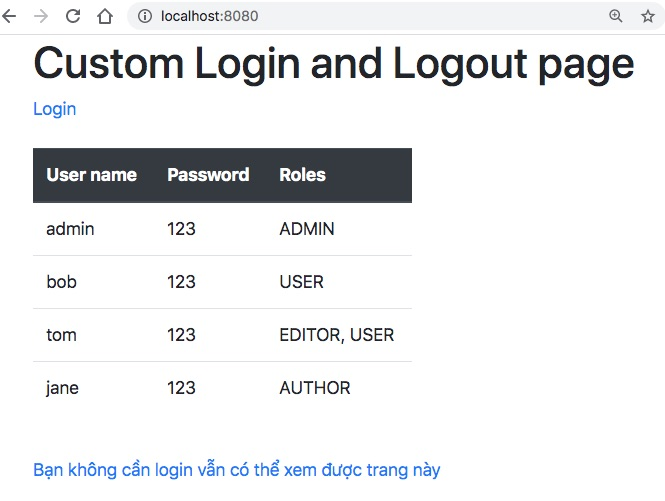
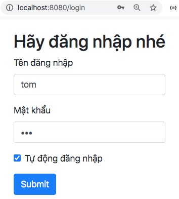
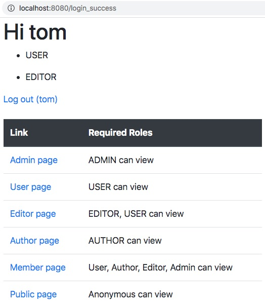
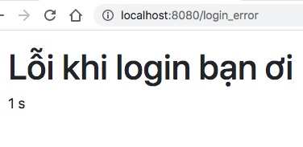
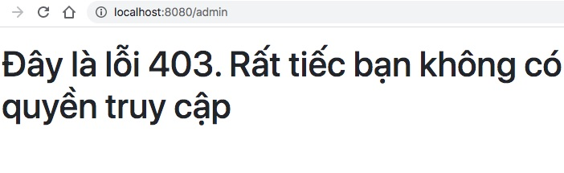
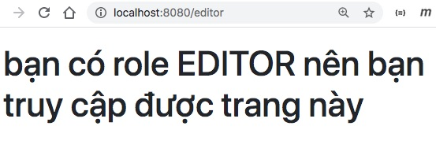
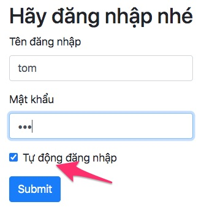
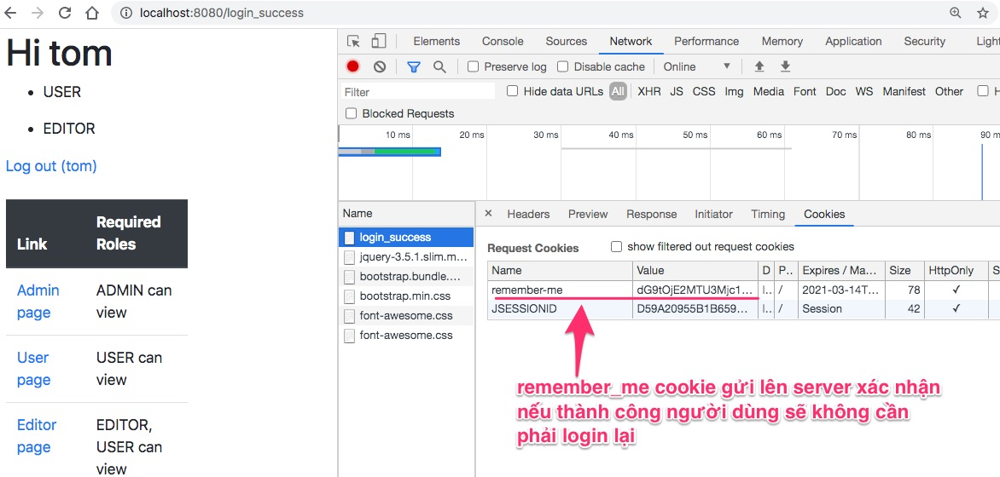

# Customize form login, logout

## Giới thiệu

Trong bài này tôi sẽ hướng dẫn chi tiết từng bước để:
- customize form login sử dụng Bootstrap
- customize form logout
- xử lý lỗi login, logout
- làm sao để ghi nhớ lần đăng nhập thành công trước đây (tự động đăng nhập hay còn gọi là remember me)

### Một số hình chụp giao diện cuối cùng

Trang chủ [index.html](src/main/resources/templates/index.html)



Màn hình [login.html](src/main/resources/templates/login.html)



Sau khi login thành công, người dùng xem được [login_success.html](src/main/resources/templates/logout_success.html)



Nếu login lỗi thì chuyển đến trang này [login_error.html](src/main/resources/templates/login_error.html)



Sau vài giây đếm ngược, trang này lại chuyển về màn hình đăng nhập [login.html](src/main/resources/templates/login.html)

Nếu người dùng truy cập vào trang không có quyền, thì nhận báo lỗi [403.html](src/main/resources/templates/error/403.html)



Còn nếu có quyền truy cập hợp lý thì xem được trang



## Giải thích một số hàm phần quyền truy cập

Chúng ta cấu hình phân quyền bằng cách định nghĩa [class SecurityConfig](src/main/java/vn/techmaster/securityjpa/config/SecurityConfig.java) kế thừa ```interface WebSecurityConfigurerAdapter``` , và được đánh dấu bởi 2 annotation ```@Configuration, @EnableWebSecurity```


```java
@Configuration
@EnableWebSecurity
public class SecurityConfig extends WebSecurityConfigurerAdapter {
  @Override
  protected void configure(HttpSecurity http) throws Exception {
   ///
  }
}
```
### Giải thích các hàm phân quyền theo đường dẫn

- ```http.authorizeRequests```: cho phép viết tiếp các luật phân quyền truy cập 
- ```.anyRequest()```: luật áp dụng cho mọi request
- ```.permitAll()```: cho phép tất cả truy cập
- ```.hasAuthority("WRITE")```: phải có quyền Authority
- ```.hasAnyAuthority("WRITE", "READ")```: có bất kỳ 1 trong các quyền sau
- ```.hasRole("AUTHOR")```: phải có role là AUTHOR 
- ```.hasAnyRole("AUTHOR", "EDITOR")```: phải có một trong những role liệt kê
- ```.access()``` tạo tập luật phức tạp phân quyền ví dụ ```access("hasAuthority('READ') and !hasAuthority('DELETE')")```
- ```.denyAll()```: ngược với ```.permitAll()``` ví dụ ```.anyRequest().denyAll()```
- ```.csrf()```: bật chế độ chống [Cross Site Request Forgery](https://youtu.be/eWEgUcHPle0). Mặc định csrf được bật. Bạn có thể tắt trong khi lập trình nhưng chớ có tắt khi deploy ứng dụng web lên production.


Có 3 loại:
1. antMatchers
2. mvcMatchers (mới hơn và chặt chẽ hơn antMatchers)
3. regex matcher: sử dụng regular expression.

Trích đoạn trong câu hỏi [Difference between antMatcher and mvcMatcher](https://stackoverflow.com/questions/50536292/difference-between-antmatcher-and-mvcmatcher)

> antMatchers("/secured") matches only the exact /secured URL
> mvcMatchers("/secured") matches /secured as well as /secured/, /secured.html, /secured.xyz

## Các phương thức để tuỳ biến login form, phương thức logout

Mặc định Spring Security cung cấp sẵn form login và phương thức logout. Tuy nhiên chúng ta thường muốn chỉnh lại giao diện form login, thông báo lỗi..., thêm chức năng đăng nhập tự động, bổ xung link để tạo tài khoản mới, hoặc lấy lại password, hãy bổ xung captchar...

Tôi giải thích từng dòng lệnh một nhé

```java
 http.formLogin()  //dùng phường thức formLogin thực chất gửi Cookie JSESSIONID chứa một chuỗi token mã hoá 33684161DE1D62A1F74D0BFAADE1931A chỉ có server mới hiểu
    .loginPage("/login") //đặt lại đường dẫn form Login
    .loginProcessingUrl("/perform_login")
    .defaultSuccessUrl("/login_success", true)
    .failureUrl("/login_error")
    .failureHandler(new CustomAuthenFailureHandler())
    .and()
    .logout()
    .logoutUrl("/perform_logout")
    .logoutSuccessUrl("logout_success")
    .invalidateHttpSession(true)
    .deleteCookies("JSESSIONID")
    .logoutSuccessHandler(logoutSuccessHandler())
    .and()
    .rememberMe().key("RememberMeOption").tokenValiditySeconds(7 * 24 * 60 * 60); //7 days x 24 hours x 60 minutes x 60 seconds
```

### 1. ```.loginPage("/login")```

Trong [CommonController.java](src/main/java/vn/techmaster/securityjpa/controller/CommonController.java)

```java
@GetMapping("/login")  //Hứng request tới /login
public String showLoginForm() {
  return "login";
}
```
trả về [login.html](src/main/resources/templates/login.html)

Chú ý một trường ẩn dùng để gửi lên server ```csrf.token```
```html
<input type="hidden" th:name="${_csrf.parameterName}" th:value="${_csrf.token}"/>
```

khi mở mã nguồn HTML trả về bạn sẽ thấy đoạn code này, Spring Security tự động sinh và điền CSRF token
```html
<input type="hidden" name="_csrf" value="196a58bd-7624-464f-aa95-ccf04bb90883"/>
```

### 2. ```.loginProcessingUrl("/perform_login")``` chỉnh lại đường dẫn để post form login
Chỉnh lại đường dẫn cho action trong form login
```html
<form method="post" th:action="@{/perform_login}">
```
Xem chi tiết [login.html](src/main/resources/templates/login.html)

### 3. ```.defaultSuccessUrl("/login_success", true)``` chỉnh lại đường dẫn khi login thành công
Cấu hình nếu người dùng login thành công thì chuyển đến đường dẫn nào. Tham số boolean thứ 2 nếu là true thì luôn chuyển đến đường dẫn đã định, kể cả trước đó, người dùng đã đăng nhập thành công.

Trong [CommonController.java](src/main/java/vn/techmaster/securityjpa/controller/CommonController.java) định nghĩa phương thức hứng request /login_success

```java
@GetMapping("/login_success")
public String showLoginSuccess(Principal principal, Model model) {
  String loginName = (principal != null) ? principal.getName() : "";

  var authorities = SecurityContextHolder.getContext().getAuthentication().getAuthorities();

  model.addAttribute("login_name", loginName);
  model.addAttribute("authorities", authorities);
  return "login_success";
}
```

### 4. ```.failureUrl("/login_error")``` chỉnh lại báo lỗi login

```java
@GetMapping("/login_error")
public String showLoginError() {
  return "login_error";
}
```

Đoạn code này trong [login_error.html](src/main/resources/templates/login_error.html) sẽ tự động chuyển về đường dẫn /login sau 5 giây.
```javascript
<script>
  // Set the date we're counting down to
  var countDownDate = new Date().getTime() + 5000;

  // Update the count down every 1 second
  var x = setInterval(function () {
    // Get today's date and time
    var now = new Date().getTime();
    // Find the distance between now and the count down date
    var distance = countDownDate - now;
    var seconds = Math.floor(distance / 1000);
    // Display the result in the element with id="demo"
    document.getElementById("demo").innerHTML = seconds + " s";

    // If the count down is finished, redirect to /login form
    if (distance < 0) {
      clearInterval(x);
      document.getElementById("demo").innerHTML = "EXPIRED";
      window.location.replace("/login");
    }
  }, 200);
</script>
```

### 5. ```.failureHandler(new CustomAuthenFailureHandler())``` xử lý sự kiện login lỗi
```java
@Override
public void onAuthenticationFailure(HttpServletRequest request, HttpServletResponse response,
    AuthenticationException exception) throws IOException, ServletException {
      System.out.println("Failed to authenticate");
      response.sendRedirect("/login_error");
}
```
Xem file [CustomAuthenFailureHandler.java](src/main/java/vn/techmaster/securityjpa/security/CustomAuthenFailureHandler.java)


### 6. ```.logoutUrl("/perform_logout")``` chỉnh lại đường dẫn logout

Thuộc tính action phải trỏ đến đường dẫn logout được chỉnh lại ```th:action="@{/perform_logout}"```
Form này để dạng ẩn ```th:hidden="true"``` chủ yếu vì muốn người dùng ấn vào link thay vì ấn nút.
Để an toàn, bạn nên dùng form post gửi kèm trường CSRF token. ```<input type="hidden" th:name="${_csrf.parameterName}" th:value="${_csrf.token}"/>```
```html
<form name="logoutForm" th:action="@{/perform_logout}" method="post" th:hidden="true">
  <input type="hidden" th:name="${_csrf.parameterName}" th:value="${_csrf.token}"/>
  <input type="submit" value="Logout" />
</form>
```
sau đó dùng link với JavaScript để submit form
```html
<a href="javascript: logoutForm.submit();" th:if="${login_name != ''}" th:text="${'Log out (' + login_name + ')'}"></a>
```

### 7. ```.logoutSuccessUrl("logout_success")``` chỉnh lại địa chỉ sẽ chuyển đến khi logout thành công
```java
@GetMapping("/logout_success")
public String showLogoutSuccess() {
  return "logout_success";
}
```
[logout_success.html](src/main/resources/templates/logout_success.html)

### 8. Làm gì khi logout?

```java
.invalidateHttpSession(true)  //Xoá toàn bộ session ứng với user đăng nhập
.deleteCookies("JSESSIONID")  //Xoá coookie ghi nhớ việc đăng nhập thành công
```

Bạn có thể tự viết một logic xử lý logout như dưới đây
```java
@GetMapping("/perform_custom_logout")
public String performLogout(HttpServletRequest request, HttpServletResponse response) {
  HttpSession session = request.getSession(false);
  SecurityContextHolder.clearContext();

  if (session != null) {
    session.invalidate();
  }
  for (Cookie cookie : request.getCookies()) {
    cookie.setMaxAge(0);
  }
  return "logout";
}
```

### 9. ```.logoutSuccessHandler(logoutSuccessHandler())``` hậu xử lý khi logout thành công

```java
@Bean
public LogoutSuccessHandler logoutSuccessHandler() {
    return new CustomLogoutSuccessHandler();
}
```

```java
public class CustomLogoutSuccessHandler extends SimpleUrlLogoutSuccessHandler {
  @Override
  public void onLogoutSuccess(final HttpServletRequest request, final HttpServletResponse response, final Authentication authentication) throws IOException, ServletException {
      final String refererUrl = request.getHeader("Referer");
      System.out.println(refererUrl);
      super.onLogoutSuccess(request, response, authentication);
  }
}
```

### 10. Chọn chức năng tự động đăng nhập bằng cách nhớ người dùng
Khi bật cho phép tự động đăng nhập, có nghĩa sau lần đầu đăng nhập thành công, server sẽ cài một cookie ```remember_me``` có giá trị là một token được mã hoá. Người dùng đóng trình duyệt, sau đó mở lại, truy cập vào một trang yêu cầu phải đăng nhập. Lúc này thay vì buộc người dùng phải đăng nhập lại, thì server kiểm tra trong request có gửi cookie ```remember_me``` hợp lệ không? Nếu giải mã đúng, thì server biết rằng đây là người dùng lần trước đó đã đăng nhập thành công. 

```java
.rememberMe().key("RememberMeOption").tokenValiditySeconds(7 * 24 * 60 * 60);
```



Inspect trình duyệt để xem cookie ```remember_me``` 


